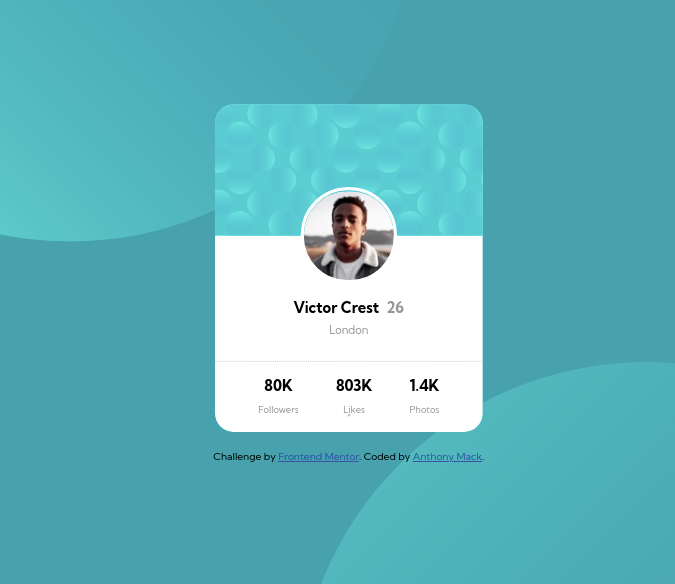

# Frontend Mentor - Profile card component solution

This is a solution to the [Profile card component challenge on Frontend Mentor](https://www.frontendmentor.io/challenges/profile-card-component-cfArpWshJ). Frontend Mentor challenges help you improve your coding skills by building realistic projects. 

## Table of contents

- [Overview](#overview)
  - [The challenge](#the-challenge)
  - [Screenshot](#screenshot)
  - [Links](#links)
- [My process](#my-process)
  - [Built with](#built-with)
  - [What I learned](#what-i-learned)
  - [Continued development](#continued-development)
  - [Useful resources](#useful-resources)
- [Author](#author)
- [Acknowledgments](#acknowledgments)

## Overview

### The challenge

- Build out the project to the designs provided

### Screenshot




### Links

- Solution URL: [GitHub/TXMack713](https://github.com/TXMack713/profile-card)
- Live Site URL: [GitHub Pages](https://txmack713.github.io/profile-card/)

## My process

I began by building out the mobile layout first and then proceeded to tweak the design until I was able to position the background images to my satisfaction. I Googled and checked StackOverflow for solutions until I was able to locate advice that informed me what specifically to target until the background circle images were both on the screen in a manner I could comfortably manipulate.

After being mostly satisfied with the mobile layout, I began developing the desktop layout and used what I learned in positioning the background images in the mobile layout to position the circles on the desktop layout. After finishing, I revisited the line-height setting of the header to position the name and age info of the card closer to the location information.
### Built with

- Semantic HTML5 markup
- CSS custom properties
- Flexbox
- CSS Grid
- Mobile-first workflow

### What I learned

I learned that by targeting the html::before and html::after selectors, I was able to position the circles on the page in a manner that greatly reduced the tendency of the images to move as the screen width was dynamically adjusted. Additionally, by targeting the top and bottom margins of the card, I was able to create the spacing I desired to keep the contents of the page visible on the screen. Finally, by specifying that the max-inline-size of the body element was 100vw and setting overflow to hidden, I was able to limit the accessible portion of the page directly to what was visible.

```css
body {
display: flex;
flex-flow: column wrap;
justify-content: center;
align-items: center;
background-color: hsl(185, 75%, 39%);
margin: 0 auto;
max-inline-size: 100vw;
}

html::before {
content: '';
position: absolute;
inline-size: 100%;
block-size: 100%;
top: -50%;
left: -50%;
z-index: -1;
background: url('./images/bg-pattern-top.svg') no-repeat;
background-size: 100%;
transform: rotate(180deg);
}

html::after {
content: '';
position: absolute;
background: url('./images/bg-pattern-bottom.svg') no-repeat;
background-size: 100%;
block-size: 100%;
inline-size: 100%;
top: 50%;
left: 50%;
z-index: -1;
}
```

### Continued development

I will continue to develop projects from Frontend Mentor to become far more proficient in developing mockups far more quickly, but I'm also working through MDN's JavaScript portion of their learn web development curriculum. I am also concurrently working through the 2nd edition of Object-Oriented JavaScript so that I can begin adding challenges that require HTML, CSS, & JavaScript to my repertoire.

### Useful resources

- The MDN Web Docs (https://developer.mozilla.org/en-US/), W3Schools (http://w3schools.com), StackOverflow (stackoverflow.com) and Kevin Powell's YouTube channel (https://www.youtube.com/user/KepowOb) were quite instrumental in helping me along the way.

## Author

- Website - [Anthony Mack](https://github.com/TXMack713/)
- Frontend Mentor - [@TXMack713](https://www.frontendmentor.io/profile/txmack713)

## Acknowledgments

Many thanks to the community over at StackOverflow for all the questions and answers that had already been asked and answered that provided ready-to-use solutions for what I was searching for answers for.